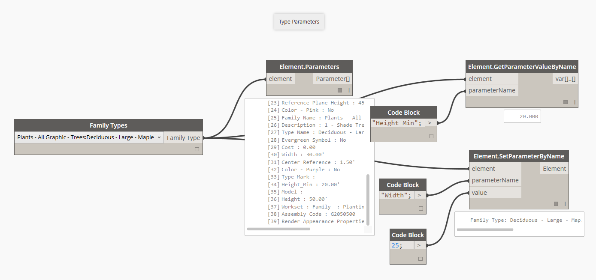
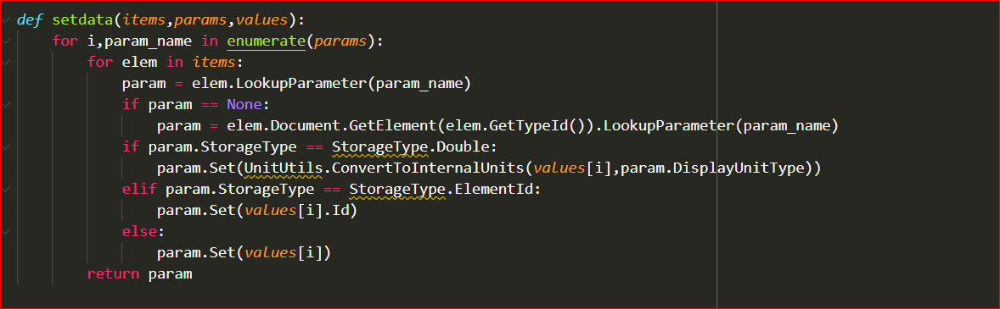
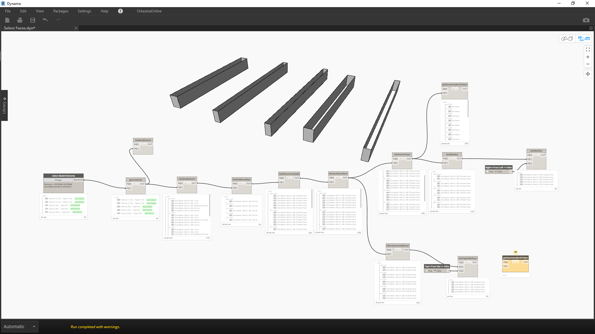
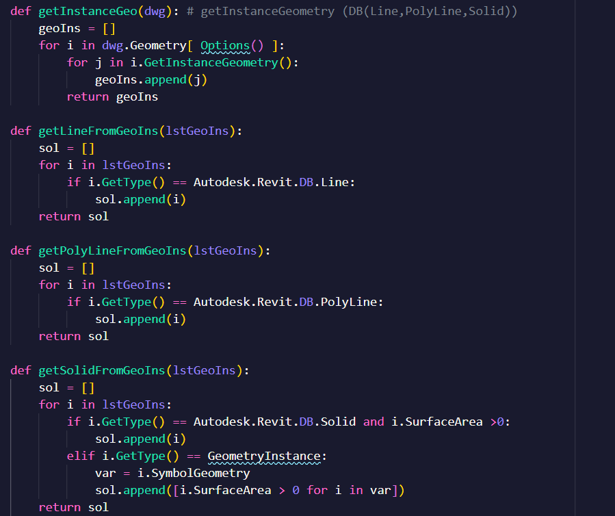
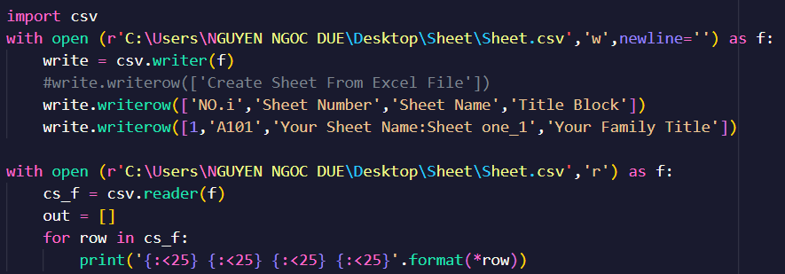
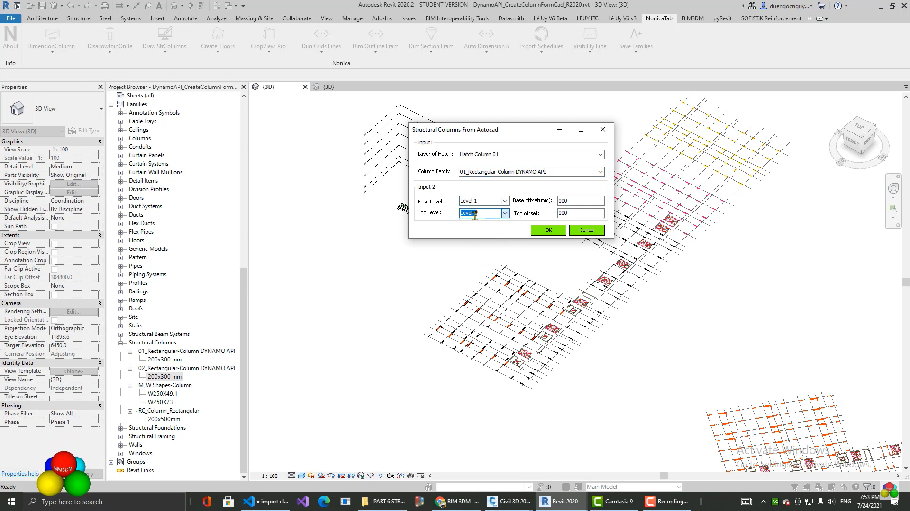
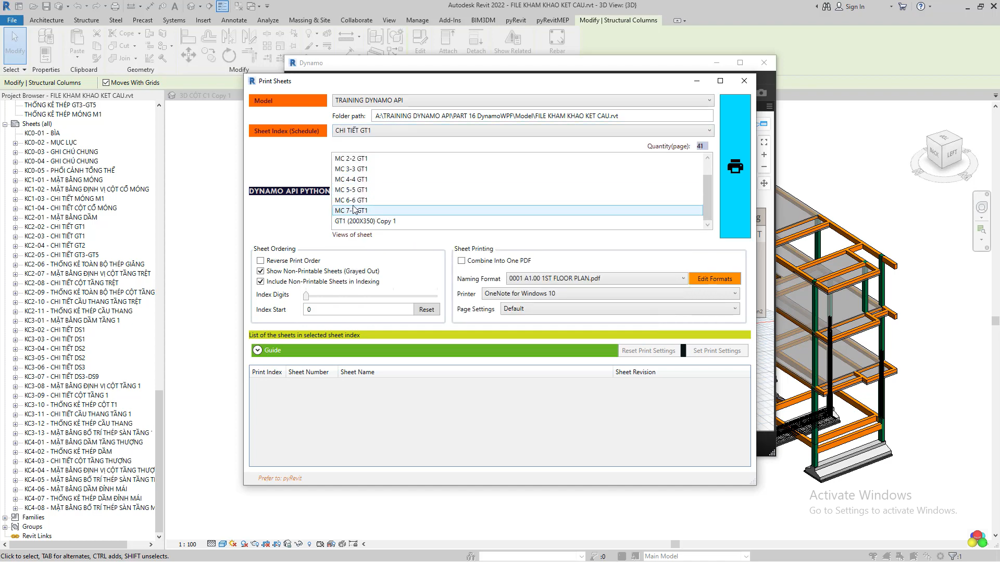

# WELCOME TO MY REPOSITORY DYNAMO API PYTHON

---

Hi,

The believers in the same passion as I do!

My hope is that work and study continue to improve day by day. That's one of the reasons to build this repository. I may temporarily call it "Dynamo API - Python". This repository contains all the information and help you need to do well.

Being the first here, having already visited the repository, or even knowing about me via my YouTube channel is an honor and blessing for me. Because I have a chance to share scripts, nodes, functions, and much more as well as experiences. Moreover, my country, Vietnam has lots of students who want to learn that. Thus, I would like to share what I know about Dynamo and Revit to encourage believers to find inspiration on the road to their careers.

This is an exciting time to be learning about, working with, and developing for Dynamo. Let's get started!

Can not wait for add minutes and seconds.!!!

## Table Of Content

### 1. Data Template

#### 1.1 Parameter Template

I identify this topic is the parameter template. The meaning is you will do with the parameters of Revit to extract its data. You can refer to pictures below to understand more:

#### 1.2 Geometry Template

In this chapter, I want to mention how to retrieve objects of geometry such as points, lines, edges, surfaces, etc. Follow along through below some pictures. Furthermore, you can refer to the functions in "GeometryTemplate.py" and the courses on my YouTube channel. ([https://www.youtube.com/watch?v=NDsK93AkrWo&amp;list=PLAw0jKncEcw6IA_zVEzMJR0pzfuClgbUy]())

updating ...

### 2. Cad template

Almost the projects Revit have related to Autocad's drawing. As I have worked through many Japan projects. I saw that all of their document often is Autocad files. You have to import it into Revit. So, you know how to extract data from drawings is an advantage.

updating ...

### 3. Excel template

As you known, Excel is a software common with almost engineering. Especially, when you use it with BIM's software is a necessity.Today, I will share with you ways that we can interact between Dynamo and Python through "Python Script" node.

updating ...

### 4. Winform template

As you write logic in scripts, you also need to take care of the user interface that allows users who are not familiar with Dynamo can use it easily. This chapter introduces you to Winform, which is used to design UX/UI.

updating ...

### 5. WPF template

Not negating Winform's effective functions. Furthermore, you want to improve **the users experience better.** Let you study WPF.

updating ...

### 6. Available Script

I was a modeler at a network company. Luckily, I was given the oppotunities to work on a variety of projects, from transportations to high buildings. Whenever I can, I try to create as many practical solutions as possible to reduce work related to "hands and feet". I have already written more than 100 scripts in one year. In this topic, I will list the name of scripts that are easy to reference.

updating ...

### 7. YOUTUBE - BIM3DM

BIM's software is often discussed on my YouTube channel. I hope that in the near future time I will be able to record another topic in English. The following is a list of lessons I completed.

updating ...

**_YouTube ✪ :_** [https://www.youtube.com/channel/UCt2JhCDDFxpYho575WTMZ4g]()

---

Hope you guys enjoy it!
