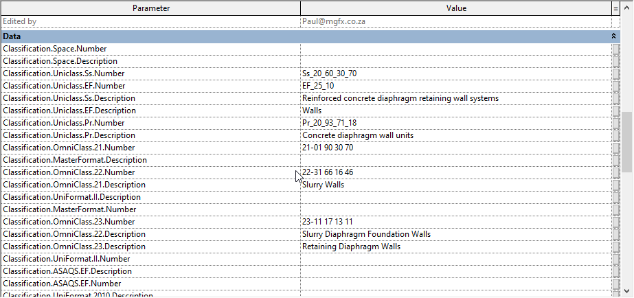

# WELCOME TO MY RESPOSITORY
DYNAMO API PYTHON

Hi,

"faithful people with the same passion as me"!

I hope work and study always get better day by day. That's one of the reasons to build this repository. I may temporarily call it "Dynamo API - Python". This repository contains all the information and help you need to do well. If you are the first in here, have already visited this repository, or even know about me via my Youtube channel those are an honor and lucky for me. Because I have a chance to share scripts, nodes, functions, and much more as soon as experiences I have. Moreover, my VietNam country has lots of students who want to learn that one. So I want to contribute a few things I know about Dynamo and Revit to help friends have inspirations on the road to career decisions.

This is an exciting time to be learning about, working with, and developing for Dynamo. Let's get started!

Can not wait for add minutes and seconds.!!!

# Table of Content

## 1. Parameter Template

I dentify this topic is parameter template. The meaning is you will do with parameter of Revit to extract its data. You can refer the table below to understand more:

## 2. Cad template

Almost projects Revit has related to Audocad's drawing. As I have worked many Japan projects. I saw that all of their document is Autocad file. You have to import its into Revit. So, extracting data of drawings are an advantage.

updating ...

## 3. Excel template

As you known, Excel is a software not known with a civil engineer. Especially, when you do it with BIM's software is a necessity. I will share with you ways that we can interac its each other by Python.

updating ...

## 4. Winform template

Another you write logics in srcipts you can also take cafe of user interface which will help users don't know Dynamo they still can use it. At topic I will introduce to you about winform which use to design UX/UI.

updating ...

## 5. WPF template

With me i saw WPF more advanced than Winform. With its strength  will be supported design complex interfaces, bring many experiences.

updating ...

## 6. Available Script

I was a modeler at a network company. Luckily, I was alowed experience varity of project from transport to high buildings. I always try create many methods to down works to related "hands and foot". I have already written near 100 scripts for one year. At this top i will list names of scripts to you are easy referent.

updating ...

## 7. YOUTUBE - BIM3DM

I have a youtube chane which ofen about BIM's software. I hope that in future time i would record another topics by English. Bellow is list of lesson i did it.

updating ...

**_Youtube ✪ Subscribe:_** https://www.youtube.com/channel/UCt2JhCDDFxpYho575WTMZ4g

---

Hope you guys enjoy it!
